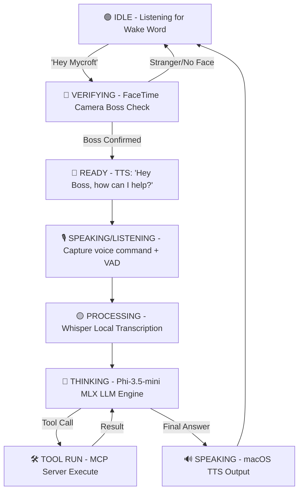

# F.R.I.D.A.Y. — 8GB-Optimized macOS AI Assistant

<p align="center">
  
  
  
  
</p>

## 📖 What is F.R.I.D.A.Y.?

F.R.I.D.A.Y. (Functional Intelligent Assistant System) is a local, privacy-first desktop voice agent designed specifically for Apple Silicon M-series Macs running macOS. 

Unlike cloud-based assistants (which leak private audio data and require constant internet connectivity) or standard desktop LLM wrappers (which suffer from high memory footprints and lack physical system control), F.R.I.D.A.Y. operates as a fully on-device voice companion. It is engineered with a strict **3.5 GB RAM budget** to run comfortably on standard 8GB RAM laptops (such as the MacBook Air) without causing system lag or SSD memory swapping. 

Through an integrated Model Context Protocol (MCP) tool server, the assistant acts autonomously to manage calendar schedules, check battery and storage status, interact with the clipboard, open/close software applications, control media playback, draft emails, check real-world weather, and query local sandboxed files—all triggered by a simple wake word (`Hey Mycroft`) and FaceTime HD Camera biometric facial validation.

---

## ✨ Core Capabilities

*   **100% Local & Quantized Execution**: Uses **MLX** (Apple's native machine learning framework) to run **Phi-3.5-mini 4-bit** (2.2 GB footprint) and **Distil-Whisper-Small** (0.6 GB footprint) directly on the Apple Silicon Unified Memory architecture.
*   **Zero-Overhead Facial Recognition**: Leverages the native macOS **Apple Vision Framework** via `PyObjC` for ultra-fast 1-to-1 boss identification utilizing FaceTime HD Camera with **0 MB additional Python process RAM overhead**.
*   **Zero-Plaintext Encrypted RAG**: Implements local vector semantic memory using **`sqlite-vec`** over an encrypted SQLite database. Plaintext conversations are protected with **AES-256-GCM authenticated encryption** using a cryptographic key dynamically derived from the macOS hardware Platform UUID.
*   **Robust System & App Integration**: Integrates directly with macOS applications and system resources via an advanced **MCP (Model Context Protocol) Tool Server**.
*   **State-Aware TTS Arbitration**: Uses native macOS `NSSpeechSynthesizer` (`say` utility) with instant, zero-lag preemption. If the wake word is detected while speaking, background TTS processes are instantly terminated (`killall say`), audio queues are flushed, and control is returned to user voice capture.
*   **Dynamic Memory Protection**: Active RAM guard dynamically bypasses memory safety checks on constrained 8GB systems and scales down context window lengths or skips vector database searches when system memory utilization spikes over 85%.

---

## ⚠️ System Limitations

*   **Reasoning Depth & Tool Chaining**: F.R.I.D.A.Y. is powered by a **3.8 Billion parameter model (Phi-3.5-mini)**. While it is highly capable at single, direct tool executions (e.g., *"What is my battery level?"*, *"Open Safari"*, *"What is the weather in Mumbai?"*), it will perform unreliably if requested to execute complex, multi-hop reasoning chains or pass the output of one tool dynamically into another.
*   **Memory-Driven Degraded Mode**: Under extreme RAM pressure (total system memory utilization $> 85\%$, such as when transcribing long sentences with local Whisper active), the RAG semantic memory is bypassed dynamically to prevent system swapping or OOM crashes.
*   **Single-Boss Landmark Enrollment**: The biometric face-verification subsystem is mathematically optimized as a 1-to-1 verification check to identify a single "Boss". Multi-user enrollment and fast user-switching are not supported.
*   **macOS API Dependency**: F.R.I.D.A.Y. relies strictly on native macOS system APIs, binaries, and AppleScript interfaces (`say`, `screencapture`, `AppKit`, `EventKit`). It is strictly incompatible with Windows or Linux environments.
*   **Acoustic VAD Silence Tuning**: Local speech capture operates on a voice activity detection (VAD) silence threshold (1.5 seconds). Highly noisy or low-volume microphone feeds can occasionally trigger premature stop-recording events.

---

## 🏗️ Technical Architecture & Memory Footprint

F.R.I.D.A.Y. is strictly budget-constrained, loading models lazily and garbage collecting them when idle:

| Component | Underlying Tech | RAM Footprint | Execution Context |
|-----------|-----------------|---------------|-------------------|
| **Language Model (LLM)** | Phi-3.5-mini-instruct 4-bit | `~2.20 GB` | Apple Silicon GPU (MLX) |
| **Speech-to-Text (STT)** | Distil-Whisper-Small-MLX | `~0.60 GB` | Apple Silicon GPU (MLX) |
| **Text-to-Speech (TTS)** | macOS `NSSpeechSynthesizer` | `0 MB` | macOS system process (`say`) |
| **Wake Word Detector** | OpenWakeWord (ONNX model) | `~0.05 GB` | CPU (ONNXRuntime quantized) |
| **Facial Verification** | macOS Vision Framework | `0 MB` | OS Resident CoreML Model |
| **Semantic Vector DB** | `sqlite-vec` + ONNX MiniLM | `~0.08 GB` | SQLite virtual table / CPU |
| **Bridges & Tooling** | `psutil` + `EventKit` + `AppKit` | `<0.01 GB` | Python System Utilities |
| **Total Resident Space** | | **`~2.93 GB`**| *Fully leaves 5+ GB free system space* |

### 🔄 Interactive Voice Pipeline Flow



---

## 📂 Project Structure

```
├── config/                  # App configurations and model paths
│   └── friday_config.yaml   # Top-level Pydantic-validated settings
├── data/                    # Encrypted local storage and face encodings
├── docs/                    # Architecture documents and master manifest
├── logs/                    # Rotating log files (Console, stdout, stderr)
├── scripts/                 # System automation, LaunchAgent plists, and setups
│   └── setup/               # Model downloading, installation, and face enrollment
├── src/                     # Core Python Source Package
│   ├── context/             # App focus, tracking, and telemetry logic
│   ├── core/                # CLI main, Brain, Activation Handler, and IPC state
│   ├── memory/              # sqlite-vec, AES-256-GCM encryption, RAM manager
│   ├── modules/             # Audio (STT, TTS, Wake Word) & Vision (Face recognizer)
│   ├── proactive/           # Background scheduling & system reminders
│   ├── tools/               # EventKit, AppKit, Shell, System MCP tools
│   └── utils/               # Centralized constants, Pydantic configs, and logger
├── swift-daemon/            # SwiftBar dynamic plugin script
└── tests/                   # Extensive test suites (unit & integration)
```

---

## 🛠️ Requirements & System Setup

*   **Hardware**: Apple Silicon Mac (M1, M2, M3, M4 series) with a minimum of **8 GB RAM**.
*   **Operating System**: macOS Ventura (13.0) or higher.
*   **Software**: Python 3.11 (installed via Homebrew).

### 🚀 Quick Start Installation

1.  **Clone the repository & run the automated environment setup**:
    ```bash
    make install
    ```
    *This creates a local `.venv`, updates pip, and installs all native dependencies including `mlx`, `mlx-whisper`, `psutil`, `pyaudio`, and macOS `PyObjC` bindings.*

2.  **Download local model checkpoints**:
    ```bash
    make download-model      # Downloads quantized Phi-3.5-mini (4-bit)
    make download-whisper    # Downloads Distil-Whisper-Small-MLX
    ```

3.  **Enroll your face for biometric authentication (one-time)**:
    ```bash
    make enroll-face
    ```
    *This activates the camera, guides you to collect 20 different poses, and compiles your biometric landmark signatures securely to `data/faces/boss_vision.pkl`.*

4.  **Dry-run verification**:
    ```bash
    make dry-run
    ```
    *Executes a full pre-flight verification checks on model availability, face signatures, configurations, and baseline memory pressure.*

---

## 🎛️ Command-Line Usage

Start F.R.I.D.A.Y. with standard configurations or developers overrides:

```bash
make run                   # Start assistant with normal setup
make run-debug             # Start with verbose DEBUG logs
make run-no-face           # Dev bypass: Skip face confirmation
```

Or invoke the entry point directly:
```bash
python -m src.core --debug                # Verbose debugging
python -m src.core --no-brain             # Tool-test mode (skips heavy LLM load)
python -m src.core --camera 0             # Force FaceTime HD camera index
```

---

## 🛡️ Rich Model Context Protocol (MCP) Tools

F.R.I.D.A.Y.'s local LLM makes structural tool-calls wrapped in standard `<tool_call>...</tool_call>` tags:

| Tool Name | Action Parameters | Underlying Functionality | Safety Level |
|-----------|-------------------|--------------------------|--------------|
| `get_calendar_events` | `date` | Reads calendar appointments via native Apple `EventKit` | Read-only |
| `manage_calendar` | `action`, `title`, `date`, `event_id` | Creates or deletes calendar events (EventKit) | **Requires confirmation** |
| `manage_reminders` | `action`, `title`, `reminder_id` | Adds or marks macOS Reminders as complete | Auto-execute |
| `get_system_info` | `info_type` | Retrieves system `battery`, `storage`, `memory`, `network`, `time` | Read-only |
| `control_application`| `action`, `app_name` | Opens or closes regular applications (Safari, Spotify...) | Auto-execute |
| `control_media` | `action` | Controls system volume, mute, play/pause (AppleScript) | Auto-execute |
| `clipboard` | `action`, `text` | Copies text to or reads text from system clipboard | Auto-execute |
| `read_file` | `file_path` | Reads contents of local text or markdown files | Read-only |
| `write_filesystem` | `action`, `path`, `content` | Writes files or creates directories locally | **Requires confirmation** |
| `get_weather` | `location` | Fetches highly detailed weather forecasts via `wttr.in` | Read-only |
| `web_search` | `query` | Queries duckduckgo-html search for real-world details | Read-only |
| `execute_shell` | `command` | Executes arbitrary macOS terminal shell commands | ⚠️ **Always confirms** |

---

## 🧪 Systematic Testing Guide

We maintain a layered, rigorous testing framework containing **107 automated & hardware-integrated tests**:

```bash
# ── Layer 1: Automated Unit Tests ──
make test                      # Runs all 107 test cases via pytest

# ── Layer 2: Manual Hardware Unit Verification ──
make test-wake-word            # Verifies microphone capture & OpenWakeWord confidence
make test-face                 # Captures from FaceTime camera and scores facial landmarks
make test-stt                  # Verifies local whisper model transcription & language detection
make test-tts                  # Tests NSSpeechSynthesizer volume and preemption limits

# ── Layer 3: Integration Pipeling Loops ──
make test-pipeline             # Integration test: Wake Word → FaceTime camera confirmation loop
make test-voice-pipeline       # Integration test: Mock voice conversation round-trip (STT -> Brain -> TTS)
make test-brain                # Integration test: Loads LLM, injects context, tests RAG & tools
```

---

## 🖥️ System Integration (SwiftBar & launchd)

### 🟢 Real-time Menu Bar App (SwiftBar)
F.R.I.D.A.Y. is integrated directly with the macOS menu bar via a customized **SwiftBar** script. It reads a dynamic state bridge written on every python activation step (`~/.cache/friday/status.json`) to display real-time statuses and diagnostics in the menu bar:

*   ⚫ **Offline**: F.R.I.D.A.Y. daemon is not running (includes "Click to Start" button).
*   🟢 **Idle**: Listening for wake word (`Hey Mycroft`).
*   🔵 **Verifying**: Face recognition is active.
*   🟡 **Processing**: Transcribing or reasoning.
*   🔊 **Speaking**: TTS output is playing.

### 🚀 Auto-start on System Login (`launchd`)
Install F.R.I.D.A.Y. as a persistent macOS user agent:
```bash
make install-agent     # Compiles and loads the launchd plist agent
make agent-status      # Checks launchd agent status
make agent-logs        # Tails standard out and error logs
make uninstall-agent   # Disables and removes launchd agent plist
```

---

## 📄 License

Private repository. Copyright © 2026. All rights reserved. Registered for personal research only.
