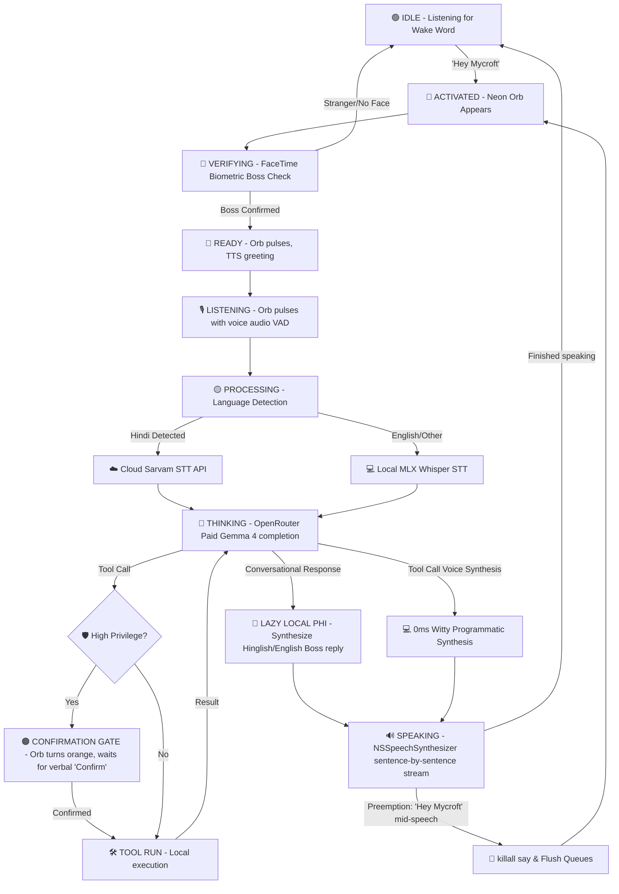

# F.R.I.D.A.Y. — 8GB-Optimized macOS AI Assistant (Bilingual & Premium Hybrid Architecture)

<p align="center">
  
  
  
  
  
</p>

## 📖 What is F.R.I.D.A.Y.?

F.R.I.D.A.Y. (Functional Intelligent Assistant System) is a privacy-first, hybrid cloud-local desktop voice companion engineered exclusively for Apple Silicon M-series Macs running macOS. 

Unlike traditional assistants that suffer from massive memory footprint lag or compromise data privacy, F.R.I.D.A.Y. operates within a strict **8GB RAM budget**. It keeps active memory low using a smart, lazy-loaded local-first design while offloading complex reasoning to a premium cloud reasoning loop. The assistant interacts with a highly authentic, witty, and loyal **F.R.I.D.A.Y.-like persona**, responding sentence-by-sentence with **sub-second streaming voice latency**.

Through interactive system tools, F.R.I.D.A.Y. manages your calendar, checks macOS battery and system diagnostics, reads and writes files, sends iMessages/emails, and tracks your active workspace apps—all triggered by a simple wake word (`Hey Mycroft`), biometric FaceTime HD facial verification, and shown via a premium **Siri-like glowing neon orb visualizer** floating in the top-right of your screen.

---

## ✨ Core Capabilities

*   **Premium F.R.I.D.A.Y. Persona**: Beautifully witty, conversational, and hyper-cognizant. Adapts to Hindi or English seamlessly and anticipates what the "Boss" needs next.
*   **Sub-Second Voice Latency**: Streams spoken replies sentence-by-sentence as they generate (`blocking=False` in `speak()`), reducing perceived voice latency to **under 1 second**.
*   **Glowing Neon Orb**: A premium, transparent, floating circular visualizer rendered dynamically in native SwiftUI (or falling back to a legacy Tkinter visualizer when running standalone). It features procedural, hardware-accelerated volumetric depth, animating radial gradients, high-frequency rotations, and dynamic breath-cycle pulses modulated by transcription, processing, and speaking states.
*   **OpenRouter Paid Gemma 4 Loop**: Routes reasoning queries directly to the paid-tier `google/gemma-4-31b-it` model on OpenRouter, ensuring rock-solid responses and immunity to free-tier `429 Too Many Requests` rate limiting.
*   **Bilingual Auto-Detected Speech Routing**: Automatically detects the user's spoken language. If Hindi (`hi`) is detected, it instantly routes the audio bytes to the premium **Sarvam AI STT API** for high-precision Hindi script transcription, falling back to local multilingual Whisper if offline.
*   **Speedy Programmatic Synthesis**: Bypasses local Phi inference for tool calls using a witty, programmatic F.R.I.D.A.Y. synthesizer in Python, bringing tool-execution voice latency to **0ms** after tool execution.
*   **Secure 100% Vector Search (sqlite-vec)**: Plaintext history is fully encrypted on disk using AES-256-GCM authenticated encryption tied to the macOS hardware Platform UUID. Semantic searches run directly over raw float384 embeddings using `sqlite-vec` virtual tables, decrypting matching rows only in memory.
*   **Zero-Overhead FaceTime Biometrics**: Utilizes the native macOS **Apple Vision Framework** via `PyObjC` for biometric facial boss confirmation in a 2-second FaceTime camera burst, consuming **0MB** of additional resident RAM.
*   **Verbal Confirmation Engine**: Destructive, sensitive, or high-privilege actions (like running terminal shells, deleting files, or sending messages) are guarded. F.R.I.D.A.Y. halts, caches the command, asks the Boss verbally to *"Confirm"* or *"Cancel"*, and dispatches only upon positive voice affirmation.

---

## 🏗️ Technical Architecture & Memory Footprint

F.R.I.D.A.Y. loads models lazily and garbage collects them when idle to respect the 8GB RAM memory budget:

| Component | Underlying Tech | RAM Footprint | Execution Context |
|-----------|-----------------|---------------|-------------------|
| **Language Model (LLM)** | OpenRouter Paid Gemma 4-31B | `0 MB` local | Cloud Endpoint via `httpx` |
| **Speech-to-Text (STT)** | `mlx-community/whisper-small-mlx` / Sarvam | `~0.60 GB` | Apple Silicon GPU (MLX) |
| **Local Synthesis Model**| Phi-3.5-mini-instruct 4-bit (MLX) | `~2.20 GB` (lazy) | Apple Silicon GPU (loaded only on demand) |
| **Wake Word Detector** | OpenWakeWord (ONNX model) | `~0.05 GB` | CPU (ONNXRuntime quantized) |
| **Facial Verification** | macOS Vision Framework | `0 MB` | OS Resident CoreML Model |
| **Semantic Vector DB** | `sqlite-vec` + ONNX MiniLM | `~0.08 GB` | SQLite virtual table / CPU |
| **Visualizer HUD** | Standalone Native SwiftUI HUD | `<0.02 GB` | Hardware-accelerated GPU Rendering |
| **Total Resident Space** | | **`~0.85 GB`**| *Leaves 7+ GB free system space when idle* |

### 🔄 Interactive Voice Pipeline Flow



---

## 📂 Project Structure

```
├── config/                  # App configurations and model paths
│   └── friday_config.yaml   # Top-level Pydantic-validated settings
├── data/                    # Encrypted local storage and face encodings
├── docs/                    # Architecture documents and master manifest
├── logs/                    # Rotating log files (Console, stdout, stderr)
├── scripts/                 # System automation, LaunchAgent plists, and setups
│   └── setup/               # Model downloading, installation, and face enrollment
├── src/                     # Core Python Source Package
│   ├── context/             # App focus, tracking, and telemetry logic
│   ├── core/                # Brain, Activation Handler, and IPC state
│   ├── memory/              # sqlite-vec, AES-256-GCM encryption, RAM manager
│   ├── modules/             # Audio (STT, TTS, Wake Word) & Vision (Face recognizer)
│   ├── proactive/           # Background scheduling & system reminders
│   ├── tools/               # EventKit, AppKit, Shell, System MCP tools
│   └── utils/               # Centralized constants, Pydantic configs, and overlay
├── FridayUI/                # Custom standalone native macOS SwiftUI App
└── tests/                   # Extensive test suites (unit & integration)
```

---

## 🛠️ Requirements & System Setup

*   **Hardware**: Apple Silicon Mac (M1, M2, M3, M4 series) with a minimum of **8 GB RAM**.
*   **Operating System**: macOS Ventura (13.0) or higher.
*   **Software**: Python 3.11 (installed via Homebrew) and Xcode 16+ (for compiling the native App).

### 🚀 Quick Start Installation

1.  **Clone the repository & run the automated environment setup**:
    ```bash
    make install
    ```
    *This creates a local `.venv`, updates pip, and installs all native dependencies including `mlx`, `mlx-whisper`, `psutil`, `pyaudio`, and macOS `PyObjC` bindings.*

2.  **Download local model checkpoints**:
    ```bash
    make download-model      # Downloads quantized Phi-3.5-mini (4-bit)
    make download-whisper    # Downloads Distil-Whisper-Small-MLX
    ```

3.  **Configure API Keys in `.env`**:
    Create a `.env` in the project root:
    ```env
    OPENROUTER_API_KEY=sk-or-v1-your-paid-key-here
    SARVAM_API_KEY=your-sarvam-key-here
    ```

4.  **Enroll your face for biometric authentication (one-time)**:
    ```bash
    make enroll-face
    ```
    *This activates the FaceTime camera, collects 20 different poses, and compiles your biometric landmark signatures securely to `data/faces/boss_vision.pkl`.*

5.  **Dry-run verification**:
    ```bash
    make dry-run
    ```
    *Executes a full pre-flight verification check on model availability, face signatures, configurations, and baseline memory pressure.*

---

## 🎛️ Command-Line Usage

Start F.R.I.D.A.Y. with standard configurations or developer overrides:

```bash
make run                   # Start assistant with normal setup
make run-debug             # Start with verbose DEBUG logs
make run-no-face           # Dev bypass: Skip face confirmation
```

Or invoke the entry point directly:
```bash
python -m src.core --debug                # Verbose debugging
python -m src.core --no-brain             # Tool-test mode (skips heavy LLM load)
python -m src.core --camera 0             # Force FaceTime HD camera index
```

---

## 🧪 Systematic Testing Guide

We maintain a layered, rigorous testing framework containing **101 automated & hardware-integrated tests**:

```bash
# ── Layer 1: Automated Unit & Mock Tests ──
make test                      # Runs all 101 test cases via pytest

# ── Layer 2: Manual Hardware Unit Verification ──
make test-wake-word            # Verifies microphone capture & OpenWakeWord confidence
make test-face                 # Captures from FaceTime camera and scores facial landmarks
make test-stt                  # Verifies local whisper model transcription & language detection
make test-tts                  # Tests NSSpeechSynthesizer volume and preemption limits

# ── Layer 3: Integration Pipeline Loops ──
make test-pipeline             # Integration test: Wake Word → FaceTime camera confirmation loop
make test-voice-pipeline       # Integration test: Mock voice conversation round-trip (STT -> Brain -> TTS)
make test-brain                # Integration test: Loads LLM, injects context, tests RAG & tools
```

---

## 🖥️ System Integration (FridayUI & launchd)

### 🟢 Standalone Menu Bar App (FridayUI)
F.R.I.D.A.Y. is integrated directly with the macOS system layer via a custom compiled native **FridayUI** SwiftUI application. It utilizes a file-based IPC state bridge (`~/.cache/friday/status.json`) to display real-time statuses and diagnostics in the menu bar and render a gorgeous floating visualizer HUD:

*   ⚫ **Offline**: F.R.I.D.A.Y. daemon is not running (automatically boots the core on launch and cleanly stops it on app termination via native `AppDelegate` lifecycle hooks).
*   🟢 **Idle**: Listening for wake word (`Hey Mycroft`).
*   🔵 **Verifying**: FaceTime camera biometric check is active.
*   🟣 **Processing**: Transcribing, language detecting, or cloud reasoning.
*   🔴 **Speaking**: TTS output is playing.

### 🚀 Auto-start on System Login (`launchd`)
Install F.R.I.D.A.Y. as a persistent macOS user agent:
```bash
make install-agent     # Compiles and loads the launchd plist agent
make agent-status      # Checks launchd agent status
make agent-logs        # Tails standard out and error logs
make uninstall-agent   # Disables and removes launchd agent plist
```

---

## 📄 License

Private repository. Copyright © 2026. All rights reserved. Registered for personal research only.
