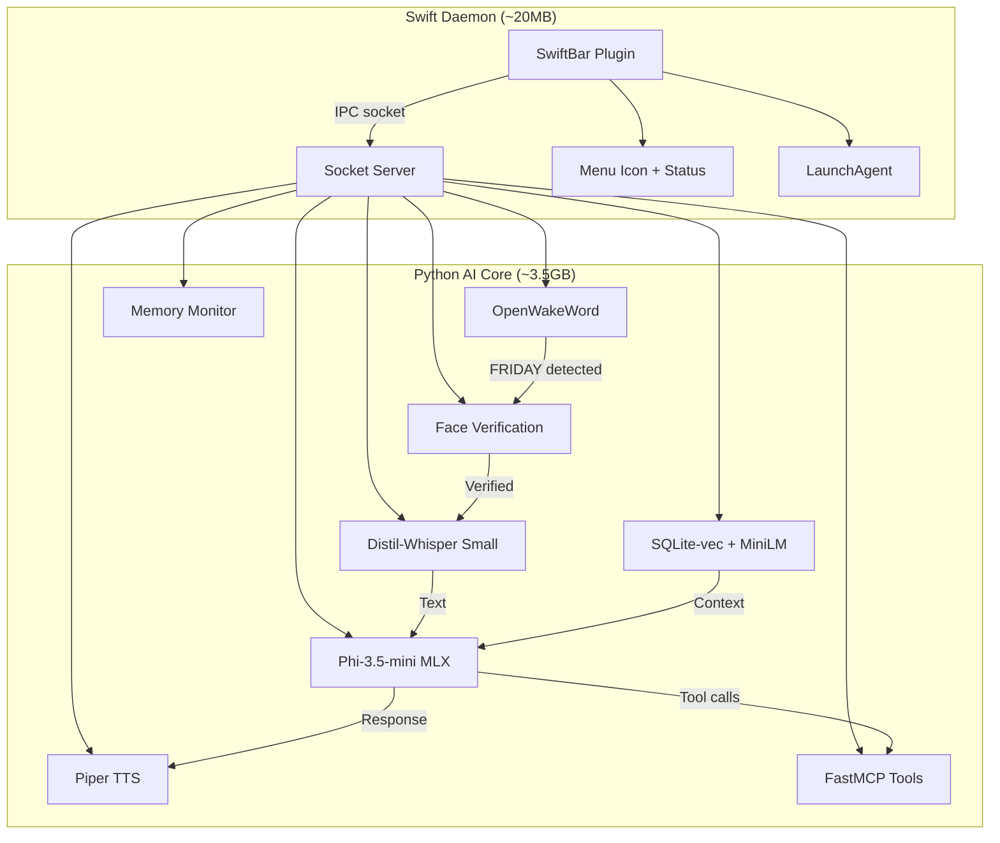

# F.R.I.D.A.Y. v2 — 8GB-Optimized Local AI Assistant

Complete rebuild of F.R.I.D.A.Y. from scratch, optimized for 8GB RAM MacBook Air running on Apple Silicon. Privacy-first, $0 ongoing cost, fully local.

## Context

Previous FRIDAY iterations (Phases 0–12) used Qwen 7B via Ollama, Milvus Lite, Kokoro TTS, Sarvam cloud APIs, and a PyQt6 HUD. That architecture consumed ~6GB RAM and had stability issues on 8GB machines. This rebuild starts fresh with a memory-efficient stack designed from the ground up for the 8GB constraint.

## Architecture Overview



## User Review Required

> [!IMPORTANT]
> **Technology Stack Pivot:** This plan replaces the entire previous stack. All previous code (Ollama, Milvus, Kokoro, PyQt6) is abandoned. The project directory is empty and we start from scratch.

> [!WARNING]
> **Apple Vision Framework Limitation:** Vision Framework provides face *detection* but NOT face *recognition*. For identity verification, we need to pair it with a lightweight embedding model (e.g., `facenet` via ONNX) to compare face embeddings against an enrolled template. This adds ~50MB but is essential for the "Face ID" use case.

> [!IMPORTANT]
> **Piper TTS Status:** The original `rhasspy/piper` repo was archived in Oct 2025. The `piper-tts` PyPI package still has macOS ARM64 wheels. Alternative: keep **Kokoro** (which already worked well) via `kokoro-onnx` for lower risk. **Which do you prefer?**

## Open Questions

1. **TTS Engine:** Piper TTS (lightweight, archived repo) vs Kokoro ONNX (proven in previous builds, slightly heavier at ~200MB)? Both are fully local.
2. **Hindi STT Accuracy:** Distil-Whisper Small has ~80% accuracy for Hindi. Is that acceptable, or should we keep the Sarvam API as a cloud fallback specifically for Hindi input?
3. **SwiftBar vs native Swift app:** SwiftBar is simpler but limited to menubar plugins. A minimal Swift daemon gives more control (notifications, global hotkey). Which approach?
4. **Face enrollment flow:** How should the initial face enrollment work? Options: (a) CLI command `friday enroll-face` that captures 5 frames, (b) automatic enrollment on first launch with verbal confirmation.

---

## Proposed Changes

### Phase 0: Project Foundation (Week 1)

#### [NEW] Project scaffold and configuration

Set up the repository structure, virtual environment, and configuration system.

```
Friday/
├── friday/
│   ├── __init__.py
│   ├── __main__.py           # Entry point
│   ├── config.py             # Pydantic Settings (all config)
│   ├── core/
│   │   ├── __init__.py
│   │   ├── brain.py          # Phi-3.5-mini MLX inference
│   │   ├── pipeline.py       # Main orchestration pipeline
│   │   └── memory_pressure.py # RAM monitoring + graceful degradation
│   ├── audio/
│   │   ├── __init__.py
│   │   ├── wake_word.py      # OpenWakeWord listener
│   │   ├── stt.py            # Distil-Whisper via mlx-whisper
│   │   └── tts.py            # Piper TTS (or Kokoro ONNX)
│   ├── vision/
│   │   ├── __init__.py
│   │   ├── face_detect.py    # Apple Vision Framework via PyObjC
│   │   └── face_verify.py    # ONNX FaceNet embedding comparison
│   ├── memory/
│   │   ├── __init__.py
│   │   ├── store.py          # SQLite-vec vector store
│   │   ├── embeddings.py     # MiniLM ONNX embeddings
│   │   └── encryption.py     # AES-256-GCM at rest
│   ├── tools/
│   │   ├── __init__.py
│   │   ├── server.py         # FastMCP tool server
│   │   ├── calendar_tool.py  # Calendar integration
│   │   ├── file_tool.py      # File operations
│   │   └── system_tool.py    # System commands
│   ├── context/
│   │   ├── __init__.py
│   │   ├── active_app.py     # NSWorkspace active app detection
│   │   └── proactive.py      # Proactive suggestion engine
│   └── utils/
│       ├── __init__.py
│       ├── constants.py
│       └── logger.py
├── swift/
│   └── FridayMenuBar/        # SwiftBar plugin or Swift daemon
├── scripts/
│   ├── setup.sh              # One-shot environment setup
│   └── enroll_face.py        # Face enrollment CLI
├── data/
│   ├── models/               # Downloaded model weights
│   ├── db/                   # SQLite databases
│   └── faces/                # Encrypted face embeddings
├── requirements.txt
├── pyproject.toml
└── .env
```

**Key files:**

| File | Purpose |
|------|---------|
| `config.py` | Single-source Pydantic Settings with env-prefix config for all subsystems |
| `requirements.txt` | Phase-gated dependencies, only active phases uncommented |
| `setup.sh` | Automated venv creation, dependency install, model download |

---

### Phase 1: Wake Word + Audio Pipeline (Week 1-2)

#### [NEW] `friday/audio/wake_word.py`
- OpenWakeWord continuous listener on dedicated thread
- Custom "FRIDAY" wake word model (or use built-in "hey_jarvis" as placeholder)
- Callback triggers face verification → STT pipeline
- Energy-efficient: uses VAD to avoid constant processing

#### [NEW] `friday/audio/stt.py`
- `mlx-whisper` with `mlx-community/distil-whisper-small.en` model (~250MB)
- Streaming audio capture via `sounddevice`
- Silence detection via WebRTC VAD for auto-stop
- Hindi support: detect language in transcription result, optionally re-route to Sarvam API

#### [NEW] `friday/audio/tts.py`
- Piper TTS with a selected English voice model (~60MB ONNX)
- Streaming playback: start speaking before full generation completes
- macOS `say` command as fallback (zero memory cost)
- Queue-based: prevents overlapping speech

---

### Phase 2: Face Verification (Week 2)

#### [NEW] `friday/vision/face_detect.py`
- Apple Vision Framework via `pyobjc-framework-Vision`
- `VNDetectFaceRectanglesRequest` for face detection from webcam frame
- Zero memory overhead (uses GPU-accelerated native framework)
- Returns bounding box + confidence

#### [NEW] `friday/vision/face_verify.py`
- Lightweight ONNX face embedding model (FaceNet/ArcFace, ~30MB)
- Compare detected face embedding against enrolled template
- Cosine similarity threshold (default 0.7)
- Enrollment: `scripts/enroll_face.py` captures 5 reference embeddings

---

### Phase 3: LLM Brain (Week 2-3)

#### [NEW] `friday/core/brain.py`
- Phi-3.5-mini-instruct 4-bit via `mlx-lm` (~2.2GB)
- Tool-calling support via Phi-3.5's native function calling format
- Streaming token generation
- Context window management (max 4096 tokens, auto-truncate history)
- System prompt with FRIDAY persona

#### [NEW] `friday/core/pipeline.py`
- Main orchestration: wake word → face verify → STT → Brain → TTS
- State machine: IDLE → LISTENING → VERIFYING → PROCESSING → SPEAKING
- Async pipeline with proper cancellation
- Memory pressure checks before heavy operations

#### [NEW] `friday/core/memory_pressure.py`
- `psutil` continuous RAM monitoring
- Thresholds: NORMAL (<80%), WARNING (80-90%), CRITICAL (>90%)
- WARNING: reduce LLM context window, clear caches
- CRITICAL: warn user, skip non-essential operations
- Chrome/heavy app detection with user notification

---

### Phase 4: Memory & Context (Week 3-4)

#### [NEW] `friday/memory/store.py`
- `sqlite-vec` extension for vector similarity search
- SQLite database with two tables: `conversations` (episodic) and `facts` (semantic)
- Hybrid search: vector similarity + FTS5 keyword matching
- Disk-backed: vectors can swap to disk under memory pressure
- Auto-cleanup: limit to last 500 conversation turns

#### [NEW] `friday/memory/embeddings.py`
- `all-MiniLM-L6-v2` via ONNX Runtime (~80MB)
- 384-dimensional embeddings
- Batch encoding for initial corpus indexing

#### [NEW] `friday/memory/encryption.py`
- AES-256-GCM encryption for stored text (reuse proven pattern from v1)
- Key derivation from env variable or machine fingerprint

---

### Phase 5: Tools via FastMCP (Week 4-5)

#### [NEW] `friday/tools/server.py`
- FastMCP server exposing tools to the LLM brain
- Tool registration via `@mcp.tool()` decorators
- Runs in-process (no stdio subprocess needed)

#### [NEW] `friday/tools/calendar_tool.py`
- Read macOS Calendar via PyObjC (`EventKit`)
- Get upcoming events, create reminders
- Proactive: check for meetings in next 15 minutes

#### [NEW] `friday/tools/file_tool.py`
- List, read, search files in allowed directories
- Sandboxed: only `~/Documents`, `~/Desktop`, project root

#### [NEW] `friday/tools/system_tool.py`
- Get system info (battery, storage, network)
- Open applications
- Basic shell command execution (with confirmation)

---

### Phase 6: Context Awareness (Week 5-6)

#### [NEW] `friday/context/active_app.py`
- `NSWorkspace` via PyObjC to detect current active application
- No screen recording — just app name and window title
- Feed context to LLM for situational responses

#### [NEW] `friday/context/proactive.py`
- Timer-based proactive engine
- Check calendar every 15 minutes for upcoming meetings
- Suggest breaks after 2 hours of continuous activity
- Morning briefing on first activation

---

### Phase 7: Swift Menu Bar Daemon (Week 6-7)

#### [NEW] `swift/FridayMenuBar/`
- Minimal Swift app or SwiftBar plugin
- Shows FRIDAY status in menu bar (🟢 active, 🟡 listening, ⚪ idle)
- LaunchAgent plist for auto-start on login
- IPC via Unix domain socket to Python AI core
- Click to toggle listening, right-click for settings

---

### Phase 8: Security & Polish (Week 7-8)

#### [MODIFY] `friday/core/pipeline.py`
- Add input sanitization (prompt injection defense)
- Rate limiting on tool calls
- Restricted file patterns (`.env`, `.key`, etc.)

#### [NEW] Integration testing
- End-to-end: wake word → face → STT → LLM → TTS
- Memory pressure simulation tests
- Tool execution sandboxing verification

---

## Memory Budget

| Component | Resident RAM | Notes |
|-----------|-------------|-------|
| Python interpreter + framework | ~150MB | Base overhead |
| OpenWakeWord | ~50MB | Always-on, very lightweight |
| Distil-Whisper Small (MLX) | ~250MB | Loaded once, kept resident |
| Phi-3.5-mini 4-bit (MLX) | ~2.2GB | Largest component |
| Piper TTS | ~60MB | ONNX model |
| MiniLM embeddings | ~80MB | ONNX, shared with memory |
| FaceNet ONNX | ~30MB | Small embedding model |
| SQLite-vec + data | ~100MB | Mostly disk-backed |
| Misc (buffers, caches) | ~100MB | Audio buffers, etc. |
| **Total** | **~3.0GB** | **Well within 8GB budget** |

Remaining ~5GB for macOS + user apps. With macOS memory compression, light browsing alongside FRIDAY is feasible.

---

## Verification Plan

### Automated Tests
- `python -c "from friday.config import get_settings; print('✓ Config')"` — Config loads
- `python -c "import mlx_whisper; print('✓ MLX Whisper')"` — STT available
- `python -c "import mlx.core; print('✓ MLX')"` — MLX framework available
- `python scripts/enroll_face.py --test` — Face detection works
- `python -m pytest tests/` — Full test suite

### Manual Verification
- Say "FRIDAY" → face verification → ask question → hear response
- Check `psutil.virtual_memory().percent` stays < 85% during operation
- Verify tools work: "What's on my calendar today?"
- Verify memory: tell FRIDAY a preference, ask about it later
- Battery drain test: 1 hour idle monitoring

### Performance Benchmarks
| Metric | Target | How to Measure |
|--------|--------|----------------|
| Wake word latency | <200ms | Timestamp delta in logs |
| Face verification | <800ms | `time.perf_counter()` around pipeline |
| Voice round-trip | <3s | End-to-end with timer |
| LLM first token | <500ms | MLX streaming callback |
| RAM usage | <3.5GB | `psutil.virtual_memory().rss` |
| CPU idle | <5% | `psutil.cpu_percent(interval=5)` |