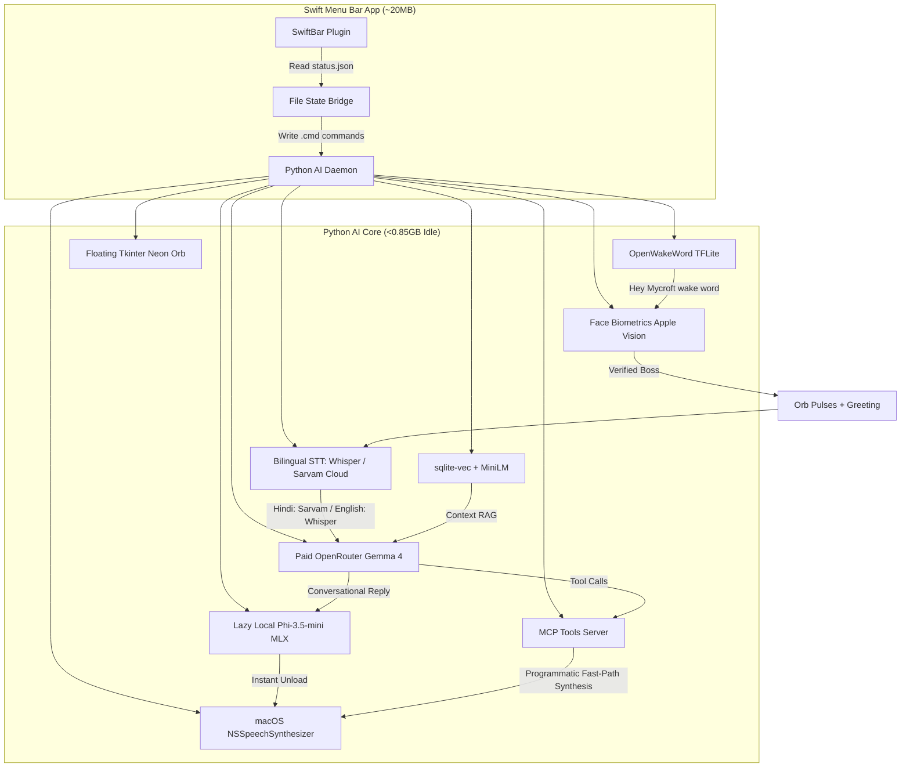

# Phase Set 1: Multimodal Activation Loop & Premium Speech Architecture

Complete rebuild of F.R.I.D.A.Y. from scratch, optimized for 8GB RAM MacBook Air running on Apple Silicon. Privacy-first, hybrid cloud-local execution, F.R.I.D.A.Y. conversational persona.

## Context

Previous FRIDAY iterations had high local RAM footprints (~6GB RAM) and stability issues on 8GB machines. This premium architecture offloads reasoning to a paid cloud endpoint on OpenRouter, bringing local idle memory below 1.0 GB while enabling hyper-intelligent tools integration and sentence-by-sentence streaming voice replies.

## Architecture Overview



---

## Technical Stack & Design Choices

1. **Biometric face verification via Apple Vision**:
   - Accesses system-resident CoreML models with **0 MB additional Python process RAM overhead** via native Apple Vision Framework (`PyObjC` bindings).
   - Guidance UI shown via the premium **Siri-like glowing neon orb** overlay running inside a thread-safe Tkinter background GUI.
2. **State-Aware Audio Preemption**:
   - Uses native macOS `NSSpeechSynthesizer` (`say` utility) with zero neural model overhead.
   - If the wake word is detected mid-speech, the system immediately runs `killall say` to purge playback buffers instantly, returning prompt control to the user.
3. **Bilingual Speech Engine**:
   - Auto-detects English or Hindi locally. Hindi streams route instantly to **Sarvam AI STT API** for high-accuracy Devanagari script, with robust offline fallback to local multilingual `mlx-whisper`.
4. **Sub-Second Streaming Voice Reply**:
   - Streams sentences block-by-block asynchronously (`blocking=False` in `speak()`), keeping speech latency **under 1 second**.

---

## Proposed Changes

### Component 1: Scaffold & Activation loop (Phase 1)

Set up the repository structure, virtual environment, and configuration system.

```
Friday/
├── config/
│   └── friday_config.yaml    # Config validation
├── data/
│   ├── faces/                # Biometric template references
│   └── db/                   # sqlite-vec database
├── docs/
│   └── implementation-plans/ # Step-by-step blueprints
├── src/
│   ├── core/
│   │   ├── __main__.py       # CLI Entry Point
│   │   ├── brain.py          # Cloud LLM & Local Synthesis
│   │   └── activation_handler.py # Orb visualizer & state machine
│   ├── modules/
│   │   ├── audio/
│   │   │   ├── wake_word.py  # OpenWakeWord
│   │   │   ├── stt.py        # Bilingual STT
│   │   │   └── tts.py        # NSSpeechSynthesizer Streamer
│   │   └── vision/
│   │       └── face_recognizer.py # Apple Vision Biometrics
│   ├── utils/
│   │   ├── constants.py
│   │   └── overlay.py        # Floating Tkinter Neon Orb GUI
│   └── memory/
└── swift-daemon/
    └── friday.1s.sh          # SwiftBar Menu Bar Script
```

---

### Component 2: The Face Biometrics Loop (Phase 2)
* **Facial Landmarks extraction**: Enrolls and builds a 1-to-1 boss biometric landmark verification cache securely stored under `data/faces/boss_vision.pkl`.
* **Zero-Overhead Biometrics**: Rejects large external frameworks in favor of native macOS Apple Vision `VNDetectFaceRectanglesRequest` calls, executing facial landmark analysis on macOS CoreML with zero overhead.

---

### Component 3: Voice & Speech Engine (Phase 3)
* **Speech-to-Text (`mlx-whisper`)**: Integrates multilingual `mlx-community/whisper-small-mlx` for local audio transcribing.
* **Text-to-Speech (`NSSpeechSynthesizer`)**: Harnesses native macOS `NSSpeechSynthesizer` wrapping, introducing sentence-by-sentence queue-based asynchronous playback to bypass blocking synthesis latency.

---

## Verification Plan

### Automated Tests
* Execute unit and integration tests under virtual environments:
  ```bash
  make test
  ```

### Manual Verification
1. Boot daemon: `python -m src.core`.
2. Speak `"Hey Mycroft"`. Confirm the floating circular neon visualizer appears instantly in the top-right of your screen, FACE HD camera verification fires in a 2-second burst, and F.R.I.D.A.Y. welcomes you verbally.
3. Speak mid-speech to verify preemption instantly terminates background speech.