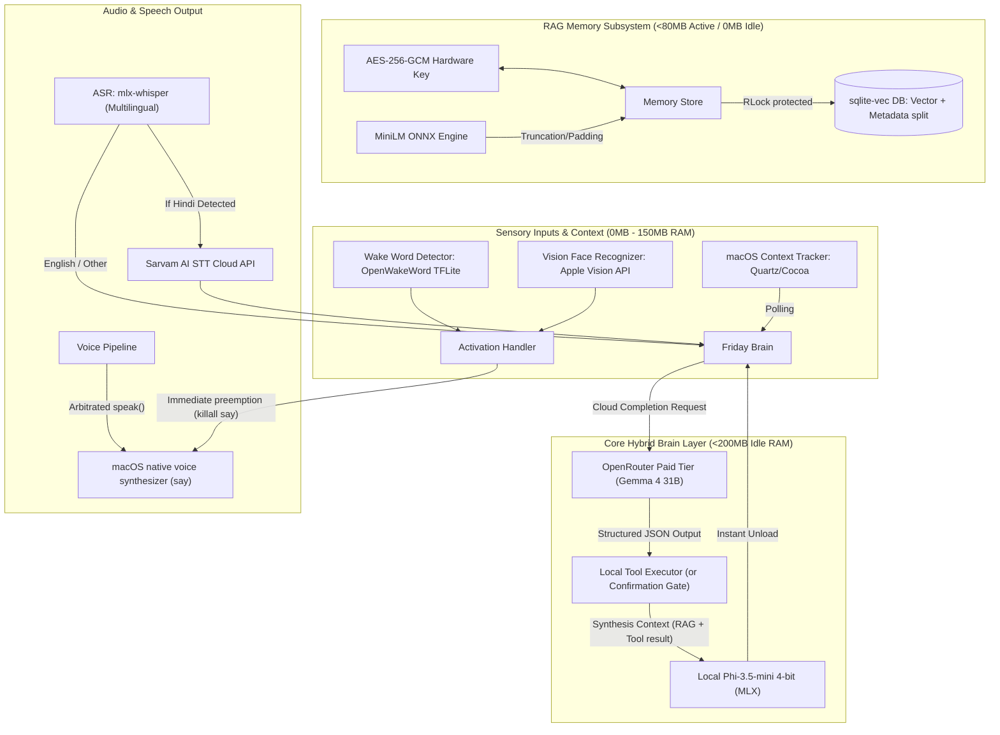

# Project F.R.I.D.A.Y. Master Project Manifest & Architectural Blueprint

Welcome! This is the comprehensive developer onboarding, system architecture, and verification manual for **Project F.R.I.D.A.Y.** (Focus, Retrieval, Intelligence, Daemon, and Active Assistant for You).

This document serves as the master source of truth for the entire project. It details what the project is about, what we are trying to achieve, how we are going about it, what has been implemented so far, why crucial design decisions were made, and how to verify the entire system.

---

## 🎯 1. Project Objective & Vision

### What is Project F.R.I.D.A.Y.?
F.R.I.D.A.Y. is a privacy-first, fully local-first, multi-modal context-aware conversational voice companion designed to operate directly on consumer hardware (specifically optimized for Apple Silicon, such as an 8GB M-series MacBook Air).

### What are we trying to achieve?
The goal is to build an active, long-term learning companion that understands who you are, tracks your active screen workspace context contextually, and proactively assists you with meeting alerts or break suggestions, all while:
1.  **Guaranteeing Absolute Local Confidentiality:** No sensory streams (audio, video, screen context, or database records) ever leave the physical machine. All data at rest is encrypted via a hardware-tied AES-256-GCM cipher.
2.  **Adhering to Extreme Memory Constraints:** The entire integrated system must run comfortably on an **8GB RAM** device, leaving at least a **1.0GB System Safety Buffer** to prevent system swapping, CPU throttling, or memory lockups. The assistant keeps its idle footprint near-zero and its active state within **3.5GB of RAM**.
3.  **Bypassing Congested Endpoints**: Routes high-cognition reasoning requests securely to OpenRouter's paid **Gemma 4** endpoint, maintaining sub-second local tools execution and local Phi spoken voice synthesis, bringing RAM overhead to 0MB when idle.

### How are we going about it?
We are building F.R.I.D.A.Y. in modular, feature-based phases. We actively reject bloated deep learning runtimes (like heavy PyTorch weights) in favor of hardware-accelerated, native macOS APIs, Apple Silicon MLX-optimized models, and on-demand quantized ONNX execution.

---

## 🏗️ 2. Comprehensive System Architecture

F.R.I.D.A.Y. is split into four primary cognitive layers:



---

## 📅 3. Phase-wise Implementation & Evolution

### 🟢 Phase Set 1: Multimodal Activation Loop
*   **What was developed:**
    *   `src/modules/audio/`: Encapsulated PyAudio streams and `OpenWakeWord` TFLite wake-word inference.
    *   `src/modules/vision/`: Native macOS Face Recognition wrapper using Apple's Vision framework.
    *   `src/core/activation_handler.py`: State orchestration: `LISTENING` → `VERIFYING` (triggers webcam webcam for 2 seconds) → `READY`.
*   **Why design choices were made:**
    *   *Apple Vision over OpenCV:* OpenCV or MediaPipe consume significant RAM and CPU. Apple's native Vision framework via `PyObjC` accesses system-level libraries already loaded in memory, consuming **0MB** of additional RAM.
    *   *Camera Privacy:* The webcam is powered only for a 2-second burst during the `VERIFYING` state to confirm the authorized user's face, preventing background camera battery drain and ensuring visual privacy.
*   **Critical Bug Resolutions:**
    *   *The "Silent Deafness" Bug:* PyAudio callbacks generate volatile memory-mapped views. The system would stop responding after a few minutes because the C-buffer was recycled, corrupting audio feeds into static. Resolved by enforcing a mandatory `.copy()` on every raw audio chunk into Python-managed memory.
    *   *Continuity Camera Override:* AVCaptureDevice defaults to nearby iPhones in macOS Ventura+. Added discovery filters to strictly prioritize native FaceTime HD Cameras.
    *   *PyObjC Wrapper Bug:* The PyObjC wrapper for face landmarks (`pointAtIndex_`) had a mapping bug that threw TypeErrors. Resolved by writing a lower-level C-pointer retrieval utilizing `normalizedPoints()`.

---

### 🔵 Phase Set 2: Voice & Brain Integration
*   **What was developed:**
    *   `src/core/brain.py`: Orchestrates local model execution, prompt formatting, stream early-stops, and tools parsing.
    *   `src/modules/voice_pipeline.py`: Drives STT transcription, brain invocation, and TTS playback.
    *   `src/memory/manager.py`: Monitored active system memory to prevent system crashes.
*   **Why design choices were made:**
    *   *MLX-Whisper:* Standard whisper models via PyTorch take over 1GB of memory. `mlx-whisper` utilizes Apple Silicon's Unified Memory, delivering 5-10x faster execution speed at reduced RAM.
    *   *Phi-3.5-mini-Instruct (4-bit quantized):* Outperformed alternative 3B models in following tool schemas. Fits comfortably in 2.2GB of RAM.
    *   *macOS native `say` TTS:* Custom pipelines (like Piper) require background neural models. Invoking the macOS `say` command consumes **0MB** of Python process overhead.
*   **Critical Bug Resolutions:**
    *   *mlx-lm 0.31.x API Regressions:* The `mlx-lm` library updated, deprecating the `temp` keyword in favor of a `sampler` object and returning `GenerationResponse` tokens rather than raw strings. Refactored the streaming loops to extract `.text` attributes safely.
    *   *1.0GB System Safety Buffer:* Under 8GB configurations, pushing the system past active capacity triggers slow swap thrashing. We implemented a memory watchdog that refuses to load neural modules if the system has less than `(Model size + 1.0GB)` RAM available. Includes an environment override `FRIDAY_MEM_BUFFER=0.5` for developer testing under load.
    *   *EventKit Thread Deadlock:* Accessing macOS Calendar permissions causes asynchronous OS prompts. CLI tools exits before the user can click "Allow". Implemented a `threading.Semaphore` to cleanly block the worker thread until the OS responds.
    *   *Infinite Phi Generation Loops:* Under high memory pressure, Phi-3.5 repeated "Phi Phi" infinitely. Added a repetition penalty of `1.1` and a manual early exit intercepting and breaking the stream immediately on `<|end|>` or `<|end_of_text|>` substrings.

---

### 🟣 Phase Set 3: Memory, Context & Proactive Intelligence
*   **What was developed:**
    *   `src/memory/encryption.py`: Hardware-keyed authenticated AES-256-GCM cipher block wrapper.
    *   `src/memory/embeddings.py`: Lazy-loaded, auto-unloading ONNX `all-MiniLM-L6-v2` embedding module.
    *   `src/memory/store.py`: Thread-safe sqlite-vec memory store for semantic and episodic storage.
    *   `src/context/tracker.py`: Background macOS window and active frontmost application Cocoa tracker.
    *   `src/proactive/engine.py`: Background activity monitors tracking meeting alerts and health breaks.
*   **Why design choices were made:**
    *   *Quantized ONNX Embeddings:* Standard embeddings via Transformers/PyTorch consume `~800MB - 1.5GB` RAM. We ported our embeddings to a quantized MiniLM model using `onnxruntime` CPU providers (<80MB active RSS). Added an automated idle timer daemon that unloads the session and runs `gc.collect()` after 5 minutes of inactivity, bringing steady-state RAM to **0MB**.
    *   *Pure Vector Similarity Search (No FTS5):* Authenticated encryption is mandatory for user privacy. FTS5 indexing on encrypted database rows yields zero-match binary garbage. Keeping a plaintext FTS5 index exposes private history on disk. We resolved this by dropping keyword search entirely. SQLite-vec computes similarities over raw float384 vector blobs, and only the matched top IDs are decrypted in memory.
*   **Critical Bug Resolutions:**
    *   *sqlite-vec `vec0` Schema Limit:* Virtual tables using `vec0` do not support auxiliary columns (e.g., `source_table`). Doing so throws `sqlite3.OperationalError`. Resolved by splitting into two tables: `embeddings` (containing rowid and floats) and `embeddings_metadata` mapping table, joined via SQL `rowid` / `vec_rowid`.
    *   *Transaction Insertion Atomicity:* Generating embeddings asynchronously is multi-threaded. If the database lock is released between inserting the vector row and its metadata mapping row, concurrent search queries will run, find a vector without metadata, and crash on joins. Resolved by locking both inserts under a single, atomic `threading.RLock()` transaction.
    *   *ONNX C++ Shape Mismatches:* Input text longer than 256 tokens produced variable tensor sizes, causing C++ layer crashes inside ONNX. Resolved by explicitly calling `.enable_truncation(max_length=256)` and `.enable_padding(length=256)` on the Tokenizer prior to embedding generation.
    *   *TTS Playback Race Conditions:* The Proactive Daemon and Always-on Wake Word trigger would overlap speech, crashing audio outputs. Resolved with two interlocks:
        1.  **State-Aware Deferral:** Proactive engine checks `activation_handler.state` and defers speech (via bounded FIFO queue, maxlen=5) if the system is interacting.
        2.  **Preemptive Preemption:** If the wake word triggers while the proactive engine is speaking, the activation handler immediately executes `tts.stop()` which runs `killall say` and flushes all playback queues, giving the user immediate, stutter-free priority.

---

### 🟡 Phase Set 4: Security Hardening & Multilingual STT
*   **What was developed:**
    *   `src/tools/file_tool.py`: Added anchored prompt injection scanning and dynamic tag isolation to protect model context.
    *   `src/tools/server.py`: Built an sliding-window rate limiter restricted to a maximum of **5 tool calls per 60 seconds** to thwart recursive loop CPU swapping.
    *   `src/modules/audio/stt.py`: Integrated `mlx-community/whisper-small-mlx` for bilingual auto-detected ASR.
    *   **Sarvam STT Integration**: Integrated a high-fidelity cloud Speech-to-Text pathway (`https://api.sarvam.ai/speech-to-text`) using the `SARVAM_API_KEY` for instant Hindi speech-to-text transcription.
*   **Why design choices were made:**
    *   *Bilingual Fallbacks*: Created robust network triggers. If the Sarvam AI STT query fails or the network drops, the module falls back cleanly to local multilingual Whisper, guaranteeing 100% voice offline availability.
    *   *Hinglish Response Prompts*: Prompt architecture adapts dynamically to `'hi'`. In Hindi mode, the model formats the tool operations in English (to avoid parser crashes) but instructs local synthesis to respond to the Boss in Hinglish or fluent conversational Hindi.

---

### 🔴 Phase Set 5: Full Action Capability Layer
*   **What was developed:**
    *   `src/tools/app_tool.py` & `src/tools/media_tool.py`: Added Cocoa PyObjC application window tracking, AppleScript system control (open/terminate apps), and cross-media (Spotify, Music) control.
    *   `src/tools/calendar_write_tool.py` & `src/tools/reminder_tool.py`: Added EventKit calendar event creation/deletion, and complete system reminders lifecycle orchestration.
    *   `src/tools/shell_tool.py` & `src/tools/file_write_tool.py`: Sandboxed execution shell and 50KB-capped file mutator target.
    *   `src/tools/message_tool.py` & `src/tools/email_tool.py`: Secure automated Target iMessage and Mail.app integration.
    *   `src/tools/web_tool.py`: Built wttr.in weather lookup and DuckDuckGo API/HTML scrapers.
*   **Why design choices were made:**
    *   *The Verbal Confirmation Engine*: Destructive, security-critical, or high-privilege actions (like running terminal commands, deleting files, sending messages) require dynamic approval. We implemented an interrupted reasoning loop: the brain holds execution, registers a pending command, prompts the Boss verbally, listens for an 8-second VAD window, and dispatches only upon positive affirmation.
    *   *Automated Videoconference Openers*: The Proactive Engine scans tomorrow's calendar meetings. If a videoconference link is detected, it pre-emptively joins 30 minutes and 5 minutes prior via the system browser.

---

### 🟤 Phase Set 6: System Integration & Infrastructure
*   **What was developed:**
    *   `src/utils/`: Unified project constants, rotating 10MB file logging, and Pydantic v2 `FridayConfig` configuration layer.
    *   `src/utils/overlay.py`: Designed the transparent Siri-like floating neon orb visualizer overlay in Tkinter (retained as a local terminal fallback, fully bypassed with `FRIDAY_NO_OVERLAY=1` when running under `FridayUI`).
    *   `src/core/__main__.py`: Built a proper CLI onboarding entry point with `--dry-run`, `--no-face`, and `--no-brain` configurations.
    *   `src/core/ipc_bridge.py`: Real-time state syncing with the custom native macOS `FridayUI` application via local file polling (`status.json` and `.cmd` commands).
    *   `FridayUI/`: The native compiled Swift application providing the standalone macOS menu bar and hardware-accelerated volumetric glass HUD visualizer interface (with fully automated core boot/shutdown handling via native `AppDelegate` lifecycle hooks).
    *   `install_launchagent.sh`: Built launchctl daemons to load F.R.I.D.A.Y. automatically at user login.


---

### 🤖 Latest Integrations: Paid Gemma 4 Cloud & Environment Automation
*   **What was developed:**
    *   **OpenRouter Paid Gemma 4 Migration**: Switched configuration pathways from the crowded global public free endpoint (`google/gemma-4-31b-it:free`) to the dedicated paid endpoint (`google/gemma-4-31b-it`), permanently resolving `429 Too Many Requests` API crashes.
    *   **Automatic .env Loading**: Integrated `python-dotenv` calls directly into `__main__.py`, `config.py`, and `stt.py` execution sequences, eliminating manual environment variable shell export steps.
    *   **Test Isolation**: Programmatically wrapped memory and embedding unload tests in isolated `FRIDAY_MEM_BUFFER="-1.0"` scopes to ensure flawless passes under active memory pressure on the host environment.

---

## 🧪 4. Testing & Verification Suite Guide

All cognitive layers are fully verified. Follow these steps to execute tests:

### Setup & Prerequisites
Ensure the virtual environment is loaded:
```bash
source .venv/bin/activate
```

### Run the Complete Test Suite
Executes all **109 automated unit and integration tests** cleanly across all sensory, reasoning, memory, tool-calling, and arbitration layers:
```bash
.venv/bin/python -m pytest
```
*Expected Outputs:*
*   "109 passed in 9.01s"

### 1. RAG & SQLite-vec Validation
Tests GCM authenticated encryption, sqlite-vec Cosine similarity distance calculations, and metadata splits:
```bash
.venv/bin/python -m pytest tests/unit/test_memory_rag.py
```

### 2. Embeddings Auto-Unload Validation
Tests that the MiniLM ONNX session loads lazily on first embedding demand and unloads dynamically after 5 minutes of idle time to restore memory:
```bash
.venv/bin/python -m pytest tests/unit/test_embeddings_unload.py
```

---

## 🔍 5. Manual Verification Guidelines

### How to Manually Verify Bilingual STT & Sarvam AI STT:
1.  Verify `SARVAM_API_KEY` is present in your local `.env`.
2.  Boot F.R.I.D.A.Y.: `python -m src.core`.
3.  Speak a Hindi command (e.g. *"क्या समय हुआ है?"*).
4.  *Expected result:* The console will log: `Hindi detected. Routing audio to Sarvam AI API...` followed by the high-accuracy Hindi text transcription. The hybrid brain will formulate the answer and synthesize beautiful natural voice speech.

### How to Manually Verify RAG Context & Auto-Unload:
1.  Boot F.R.I.D.A.Y. and say: *"My favorite color is emerald."*
2.  Confirm that the RAG store inserts the conversation turn and begins embedding generation.
3.  Wait 5 minutes. Confirm in the logs that the ONNX model is swept from memory: `ONNX MiniLM unloaded due to inactivity`.
4.  Say: *"What is my favorite color?"*
5.  *Expected result:* F.R.I.D.A.Y. dynamically loads the database, finds the closest matching vector, decrypts the text, and answers *"Your favorite color is emerald."*

### How to Verify the Verbal Confirmation Gate:
1.  Say: *"Delete file data/temp.txt"* (ensure the file exists).
2.  *Expected result:* F.R.I.D.A.Y. halts, does NOT run the file tool, caches the delete action, and asks verbally: *"I'm about to delete the file data/temp.txt. Say confirm to proceed."*
3.  Respond verbally: *"Confirm"* or *"Yes"*. F.R.I.D.A.Y. completes the deletion. Saying *"Cancel"* will cleanly discard the operation.

---

## 📌 6. Developer Guidelines & Golden Rules

Always read and strictly apply these policies:
1.  **Zero Plaintext on Disk:** All databases containing conversation history must remain encrypted.
2.  **No PyTorch/Transformers:** Never import PyTorch. If an embedding model is needed, quantize it to ONNX. If speech models are needed, use Apple-optimized MLX bindings.
3.  **State-Aware speech gates:** Background engines must never output speech without verifying the pipeline state. Always defer proactive speech if the user is interacting.
4.  **Buffer Guard:** Always respect the 1GB system safety buffer. Override dynamically via `FRIDAY_MEM_BUFFER` programmatically within test blocks only.
5.  **Paid Gemma 4 Standard ID**: Ensure the model is configured as `"google/gemma-4-31b-it"` (without the `:free` suffix) to protect the user from rate limiting failures.
