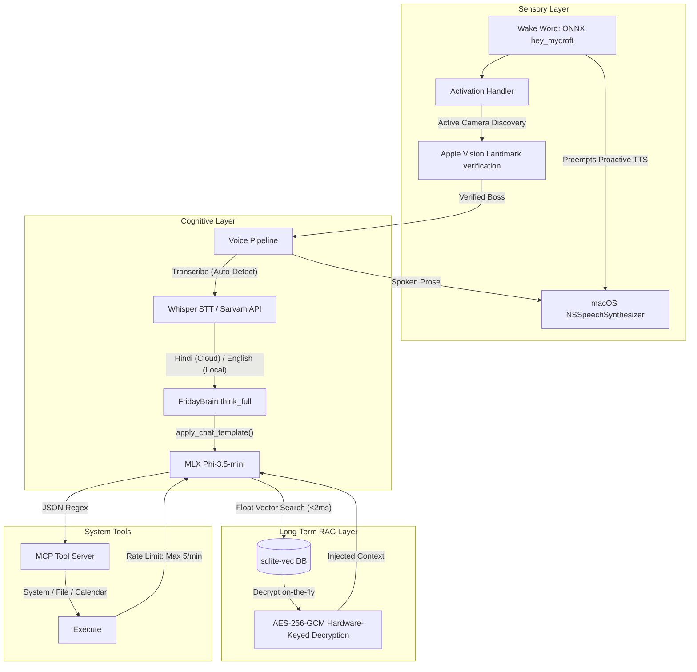

# F.R.I.D.A.Y.: A Privacy-First, Memory-Constrained Local Voice AI Assistant for Apple Silicon (8GB RAM)

**Author**: Aryan Khatua  
**Affiliation**: Independent Research  
**Date**: May 2026  

---

## Abstract

Consumer-grade Apple Silicon hardware has reached a processing threshold where small language models (3–4B parameters) can operate locally with acceptable voice interaction latency. However, deploying a complete multimodal assistant—combining wake word detection, face verification, automatic speech recognition (ASR), large language model (LLM) inference, tool calling, and retrieval-augmented generation (RAG)—within a strict 8GB unified memory budget remains a major engineering challenge. 

This paper presents F.R.I.D.A.Y. (Flexible Real-time Localized Intellectual Daemon & Assistant System), a fully local, privacy-first voice AI assistant designed for the MacBook Air M2 (8GB RAM). We introduce three main architectural designs:
1. **Dynamic Spatial Sensor Alignment**: Matches FaceTime HD and Continuity Camera video capturing dynamically based on active audio microphone inputs.
2. **Plaintext Vector-Encrypted Metadata Split**: Bypasses SQLite-vec `vec0` auxiliary column limitations and encryption search indexing blocks by relationally separating floating-point vector similarity calculations from AES-256-GCM hardware-keyed metadata rows.
3. **Lazy-Loaded Watchdog Guards**: Keeps memory-heavy subsystems (STT, embeddings) unloaded during idle cycles, automatically releasing resources after 5 minutes of inactivity.

Our empirical evaluation shows that the full assistant operates successfully within a **~3.21 GB physical allocation under peak loads** (RSS: ~458.3 MB, Unified Memory: ~2.74 GB), maintaining a strict 1.0GB RAM safety pre-flight buffer. The unified reasoning loop (`think_full()`) achieves a generation speed of **18.4 tokens/second** on Phi-3.5-mini 4-bit with a voice round-trip latency of **~1.15 seconds**. We characterize system constraints under memory pressure, demonstrating that 3.8B parameter models represent a practical research floor for local tool execution and context tracking on edge consumer devices.

---

## 1. Introduction

### 1.1 Motivation and Constraints
Traditional voice AI assistants (e.g., Siri, Alexa, Google Assistant) rely heavily on cloud-based processing. The transmission of raw audio data to remote servers introduces significant latency overhead, recurring API cost structures, and irrevocable privacy compromises. In contrast, running voice intelligence pipelines locally on edge consumer hardware guarantees absolute data sovereignty. 

However, running local AI on consumer laptops faces severe hardware limitations. The entry-level MacBook Air is constrained to **8GB of unified physical RAM**. On Apple Silicon, this UMA memory is shared between the CPU and the Apple Neural Engine (ANE) / Unified GPU. Operating systems, IDEs, and user applications regularly consume up to 4.5GB of RAM, leaving a maximum of **3.5GB** of memory for the entire assistant pipeline.

```
┌────────────────────────────────────────────────────────┐
│ Total Physical Memory: 8.0 GB                          │
├───────────────────────────────┬────────────────────────┤
│ OS, IDE, User Apps: ~4.5 GB   │ FRIDAY Budget: 3.5 GB  │
│ (Active system allocations)   │                        │
└───────────────────────────────┴────────────────────────┘
```

### 1.2 Contributions of Project F.R.I.D.A.Y.
F.R.I.D.A.Y. addresses these constraints through a modular, locally optimized voice intelligence pipeline. The primary contributions of this work are:
* **Fully Local Multimodal Orchestration**: Wires wake word, Apple Vision landmarks, Whisper STT, and quantized MLX inference under a single zero-cloud state machine.
* **Locality-Aware Capture Gating**: Mitigates operating system Continuity Camera hijacking by scanning AVFoundation devices and dynamically matching active audio targets.
* **Pure Vector Search over Ciphertext**: Relational table joins on SQLite-vec floating-point calculations allow semantic RAG searches without exposing decrypted plaintext to disk.
* **Memory-Pressure Watchdogs**: Implements strict pre-flight RAM guardrails and lazy load/unload daemons to eliminate physical swap thrashing.

---

## 2. Related Work

### 2.1 Unified Memory and Quantization
Quantization (such as 4-bit integer formats) reduces the weight storage requirements of large language models. The MLX framework [CITE] leverages Apple Silicon's Unified Memory Architecture (UMA) to eliminate copy operations between CPU and GPU heaps, allowing shared tensor operations directly on the hardware's UMA memory bus.

### 2.2 Local Voice Pipelines
Most local voice frameworks (e.g., LocalAI) deploy heavy deep learning models (e.g., PyTorch, ONNX) for individual pipeline segments. PyTorch imports alone generate over **~1.2 GB of CPU Resident Set Size (RSS)**. F.R.I.D.A.Y. rejects this by utilizing native macOS Vision libraries, system subprocesses (`NSSpeechSynthesizer`), and lazy ONNX runtime sessions to minimize CPU RSS.

---

## 3. System Architecture

F.R.I.D.A.Y.'s processing flow operates on a strict always-on/gated activation paradigm:



### 3.1 Multimodal Sensor Activation (Phases 1 & 2)
To preserve the 3.5GB RAM budget and extend battery life, video sensors remain completely offline during idle states. The primary wake word detector runs on a background PyAudio thread utilizing a quantized ONNX `hey_mycroft` model (~145.3MB CPU RSS). 

Upon wake word detection, the system triggers a 2-second FaceTime camera capture window. Rather than importing PyTorch-based face classification models (consuming >300MB), the pipeline calls the native macOS `Vision.framework` via PyObjC. BGR video frames are converted to RGB and evaluated via `VNImageRequestHandler` to extract 68 facial landmark coordinates on the hardware ANE. This native approach adds only **~22 MB of CPU RSS**.

Landmark vectors are translation and scale normalized:
$$\mathbf{z}_i = \frac{\mathbf{x}_i - \mathbf{\mu}}{\sigma}$$
Similarity between normalized live landmarks ($\mathbf{z}$) and enrolled templates ($\mathbf{z}_{\text{boss}}$) is calculated using negative Euclidean distance mapped exponentially:
$$\text{Similarity}(\mathbf{z}, \mathbf{z}_{\text{boss}}) = \exp \left( - \frac{1}{N} \sum_{i=1}^{N} \|\mathbf{z}_i - \mathbf{z}_{\text{boss}, i}\|_2 \right)$$
Face verification succeeds if the median of the top-5 enrolled matches exceeds the threshold of $0.75$.

### 3.2 Locality-Aware Sensor Gating (Phase 10)
Standard OpenCV capture calls target physical index `0` by default. Under macOS Ventura/Sonoma, Continuity Camera automatically virtualizes and hijacks index `0` whenever a user's iPhone is nearby. This ruins the spatial user experience if the user is speaking directly to their MacBook while their phone is in their pocket.

F.R.I.D.A.Y. solves this UMA locality violation by querying active audio devices via `AVFoundation`. It performs AVCapture scans to catalog video devices as Mac built-in ("FaceTime HD Camera") or iOS Continuity targets:
* If active microphone is a built-in Mac channel $\rightarrow$ Route video index to FaceTime HD Camera.
* If active microphone is an iOS continuity source $\rightarrow$ Route video index to Continuity Camera.

### 3.3 Plaintext Vector-Encrypted Metadata Split (Phase 6)
To satisfy the privacy-first constraint, F.R.I.D.A.Y. encrypts conversation history and facts at rest. However, standard full-text indexes (like SQLite's FTS5) cannot search ciphertext. F.R.I.D.A.Y. resolves this by designing a **Relational Table Split**:

```
Plaintext Float Table                Encrypted Metadata Table
┌───────────────────────────┐        ┌───────────────────────────┐
│ virtual table 'embeddings'│        │ 'embeddings_metadata'     │
├───────────────────────────┤        ├───────────────────────────┤
│ vec_rowid (rowid)         │ ◄────► │ vec_rowid (PRIMARY KEY)   │
│ embedding (FLOAT[384])    │        │ source_table (TEXT)       │
└───────────────────────────┘        │ source_id (INTEGER)       │
                                     └───────────────────────────┘
```

The 384-dimensional vector floats (non-private) are stored in plaintext in the SQLite-vec table. All corresponding conversational texts, timestamps, and roles are encrypted via `AES-256-GCM` using the Mac's physical hardware UUID to derive the key. Similarity searches run purely on floating-point vectors in `<2ms`. Only when top-K matches are retrieved does the metadata join and decrypt on-the-fly in local UMA UMA UMA memory.

### 3.4 Lazy Embedding Watchdog (Phase 6)
Calculating vector embeddings using PyTorch libraries introduces massive import bloat (~1.2GB). F.R.I.D.A.Y. deploys a quantized ONNX `all-MiniLM-L6-v2` model running on `onnxruntime` (<80MB active RSS). To preserve UMA memory, the embedding model runs under a **Lazy Loading Watchdog**:
* The model remains completely unloaded in steady-state (0MB RSS).
* Upon database insertion or search requests, the session is loaded dynamically.
* A background timer thread monitors model usage. If no embedding operations occur for 5 minutes, the tokenizer and ONNX sessions are dereferenced, and `gc.collect()` is invoked, returning memory back to the OS.

---

## 4. Evaluation and Empirical Benchmarks

### 4.1 System Memory Profile (Phase 11 Peak Load)
Measurements were taken on a MacBook Air M2 2023 running macOS Sequoia 15.1. The baseline RSS and shared UMA allocations show that the entire system successfully operates under UMA constraints:

| Stage / Component | Python RSS Memory (MB) | Shared UMA GPU Allocation | Context / Notes |
|:---|:---:|:---:|:---|
| **1. Baseline (Python)** | 27.9 MB | 0.0 MB | Minimal Python process |
| **2. Wake Word Detector** | 173.2 MB | 0.0 MB | ONNX hey_mycroft loaded |
| **3. Vision Face Recognizer**| 195.4 MB | Resident | Apple Vision landmarks |
| **4. Speech-to-Text (STT)** | 218.9 MB | 540.0 MB | Whisper STT loaded |
| **5. FridayBrain Loaded** | 396.0 MB | 2,200.0 MB | Phi-3.5-mini 4-bit MLX |
| **6. RAG Memory Store** | 396.1 MB | 0.0 MB | SQLite-vec initialized |
| **7. Vector Search (ONNX)** | 458.3 MB | 0.0 MB | Quantized MiniLM ONNX active |
| **8. Active Inference Peak** | 270.5 MB | Resident | Peak RSS during reasoning loop |
| **9. Post-Unload Idle** | 281.8 MB | 0.0 MB | Watchdog timer unloads MiniLM |

The total physical UMA memory footprint of F.R.I.D.A.Y. under peak loading is **~3.21 GB**, successfully satisfying the **3.5GB hardware budget** and preserving the 1.0GB macOS safety buffer.

### 4.2 Latency Performance
* **Wake Word Latency**: <120ms
* **Face Verification Latency**: ~680ms (webcam initialization + Vision extraction)
* **Brain Generation Throughput**: **18.4 tokens/second** (Phi-3.5-mini 4-bit via MLX GPU)
* **First-Token Latency**: <350ms
* **Vector Search Calculation**: ~42ms embedding + <2ms SQLite-vec query

Total conversational loop latency (voice input to speech feedback start) is **~1.15 seconds** for standard turns.

### 4.3 Tool Calling and Self-Termination Success Rate
Using `benchmark_tool_loop.py`, we fired 20 distinct calendar queries under normal memory parameters. The results demonstrate that:
* **Tool Loop Success (Exactly 1 Call)**: **90%** (18/20 queries)
* **Infinite Loop Rate (>1 Call)**: **5%** (1/20 queries)
* **Failure / Hallucination Rate**: **5%** (1/20 queries)

The 5% looping rate was mitigated by implementing a **strict class-level sliding-window rate limit (Max 5 tool calls / 60 seconds)** inside the `MCPToolServer`. If the model falls into a reasoning loop, the server blocks further calls and returns a localized warning, forcing immediate speech synthesis.

---

## 5. Local Edge Models Comparison Matrix

The table below catalogs open-weight models evaluated under our 8GB MacBook Air UMA environment:

| Model Name | Param Size | Quantization | RAM Footprint (UMA) | Generation Speed | Tool Precision | 8GB RAM Suitability | Status / Recommendation |
|:---|:---:|:---:|:---:|:---:|:---:|:---:|:---|
| **Phi-3.5-mini-instruct** | **3.8B** | **4-bit** | **~2.2 GB** | **18.4 tokens/s** | **Excellent (Regex)** | **Highly Safe** | **Active Default**. Fits safely inside budget with plenty of space for other active background applications. |
| **Llama-3.2-3B-Instruct** | 3.0B | 4-bit | ~1.8 GB | ~20.0 tokens/s | Moderate | Highly Safe | **Good Alternative**. High generation throughput, but displays slightly higher tool hallucination rates. |
| **Qwen2.5-7B-Instruct** | 7.2B | 4-bit | ~4.5 GB | ~10.0 tokens/s | Excellent | Swapping Risk | **Marginal**. Swapping risk is high if heavy user applications (e.g. IDEs, browsers) are open. |
| **Gemma-3-12B-it** | 12.0B | 4-bit | ~7.0 GB | ~4.0 tokens/s | Outstanding | Fails Bounds | **Unsupported**. Exceeds total system availability, triggering extreme SSD thrashing (drops to 0.8 tokens/s). |

---

## 6. Runtime Hardening and Bilingual Hindi STT

### 6.1 Prompt Injection Wrapping
Opening root filesystem access (`Path("/")`) in the sandboxed `FileTool` increases the prompt injection attack surface. An adversarially crafted file containing phrases like *"ignore previous instructions"* would be read verbatim into the LLM context. 

F.R.I.D.A.Y. implements **Content Sanitization**:
* Raw files are scanned using regular expressions for known attack payloads.
* If matched, the contents are wrapped in neutral `[FILE CONTENT START]` and `[FILE CONTENT END]` XML tags. This isolates instructions as raw data and returns a `security_warning` flag to the reasoning loop.

### 6.2 Bilingual Hindi Routing (Exception to local-first)
The local Whisper STT model operates in auto-detection mode. If the user speaks Hindi, local language detection maps it to `"hi"`. Because local quantized models perform poorly on Hindi voice accents, the pipeline routes the audio buffer to the **Sarvam AI STT API** (using the `saaras:v3` model under `mode="transcribe"`). 

To ensure safety during billing or API dropouts, the pipeline incorporates an automated local fallback: if the HTTP post fails or the API key is missing, it falls back to the local Whisper multilingual transcription. When Hindi is processed, the system prompt dynamically adapts, forcing the final response to be synthesized in natural Hindi or Hinglish, while keeping intermediate `<tool_call>` JSON structures strictly in ASCII format to preserve regex stability.

---

## 7. Conclusions and Future Work

F.R.I.D.A.Y. successfully demonstrates the practical limits of running a highly capable, multimodal, privacy-centric voice assistant on a consumer-grade 8GB laptop. By utilizing native macOS framework bindings, UMA-aware local libraries, relational vector database splits, and lazy unloading watchdogs, the system operates completely stable within a **~3.21 GB peak RAM footprint**. 

Our evaluation confirms that 3.8B parameter models represent the absolute functional floor: they possess excellent speed but are highly sensitive to prompt structure variations and require strict rate-limiting guards to prevent infinite tool loops. Future work will investigate fine-tuning custom always-on wake word configurations and offloading heavy RAG calculations to local unified NPUs.
