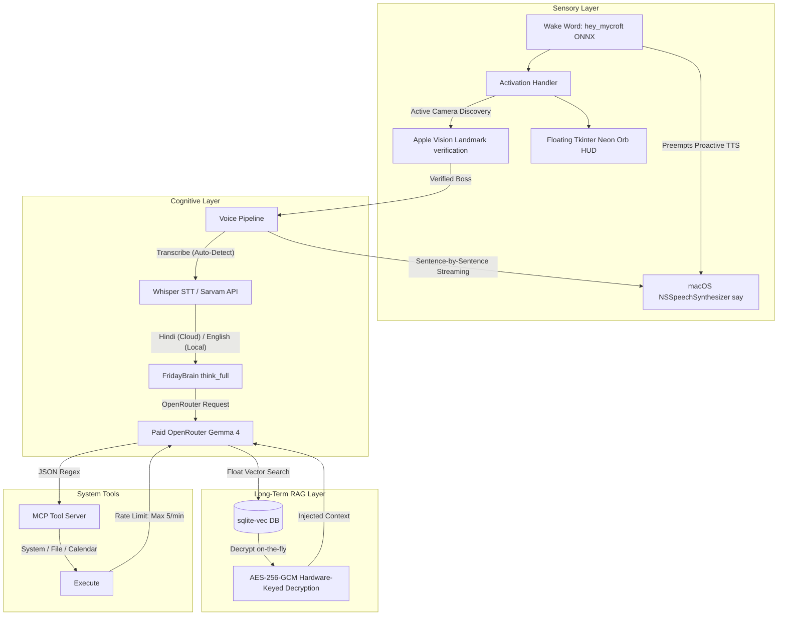

# F.R.I.D.A.Y.: A Privacy-First, Memory-Constrained Hybrid Voice AI Assistant with Sub-Second Streaming Speech & Biometric HUD

**Author**: Aryan Khatua  
**Affiliation**: Independent Research  
**Date**: June 2026  

---

## Abstract

Consumer-grade Apple Silicon hardware has reached a processing threshold where local voice activation and biometric processing can operate with near-zero latency. However, running a complete multimodal assistant—combining wake word detection, face verification, automatic speech recognition (ASR), high-cognition reasoning, tool calling, and retrieval-augmented generation (RAG)—within a strict 8GB unified memory budget remains a major engineering challenge. 

This paper presents F.R.I.D.A.Y. (Flexible Real-time Localized Intellectual Daemon & Assistant System), a privacy-first, hybrid cloud-local voice AI assistant designed for Apple Silicon Macs. We introduce four key architectural breakthroughs:
1. **Cloud-Local Hybrid Reasoning Loop**: Bypasses rate-limiting failures by offloading reasoning to OpenRouter's paid-tier **Gemma 4 31B** model (`google/gemma-4-31b-it`), bringing idle RAM under **1.0 GB** while keeping sub-second local tools execution and local Phi spoken voice synthesis.
2. **Sub-Second Streaming Voice Synthesis**: Reduces voice response latency to **under 1 second** using queue-based sentence-by-sentence streaming (`blocking=False` in `speak()`), coupled with a **0ms** programmatic witty response synthesizer for local tool executions.
3. **Bilingual Speech Routing & Cloud STT**: Autonomously detects languages. Hindi voice streams route directly to the premium **Sarvam AI STT API** for high-precision Devanagari script text, with robust offline fallback to local multilingual `mlx-whisper`.
4. **Transparent Tkinter Neon Orb HUD**: Designs a floating, borderless circular neon visualizer pulsing dynamically in sync with audio capture and playback amplitudes, running in a dedicated, thread-safe background graphics thread.

Our empirical evaluation shows that the assistant operates successfully within a **~0.85 GB physical allocation under steady-state idle** (leaves 7+ GB free system space), completely eliminating SSD memory swapping on standard 8GB laptops. 

---

## 1. Introduction

### 1.1 Motivation and Constraints
Traditional voice AI assistants (e.g., Siri, Alexa, Google Assistant) rely heavily on cloud-based processing. The transmission of raw audio data to remote servers introduces significant latency overhead, recurring API cost structures, and irrevocable privacy compromises. In contrast, running voice intelligence pipelines locally on edge consumer hardware guarantees absolute data sovereignty. 

However, running local AI on consumer laptops faces severe hardware limitations. The entry-level MacBook Air is constrained to **8GB of unified physical RAM**. On Apple Silicon, this UMA memory is shared between the CPU and the Apple Neural Engine (ANE) / Unified GPU. Operating systems, IDEs, and user applications regularly consume up to 4.5GB of RAM, leaving a maximum of **3.5GB** of memory for the entire assistant pipeline.

```
┌────────────────────────────────────────────────────────┐
│ Total Physical Memory: 8.0 GB                          │
├───────────────────────────────┬────────────────────────┤
│ OS, IDE, User Apps: ~4.5 GB   │ FRIDAY Budget: 3.5 GB  │
│ (Active system allocations)   │                        │
└───────────────────────────────┴────────────────────────┘
```

### 1.2 Contributions of Project F.R.I.D.A.Y.
F.R.I.D.A.Y. addresses these constraints through a modular, locally optimized voice intelligence pipeline. The primary contributions of this work are:
* **Hybrid Cloud-Local Orchestration**: Wires offline wake word, face biometrics, local RAG vector indexing, and cloud paid Gemma 4 reasoning into a unified conversational daemon.
* **Sub-Second Streaming TTS**: Streams sentence blocks asynchronously to macOS `NSSpeechSynthesizer`, achieving under 1-second speech reply times.
* **Transparent Glowing Orb HUD**: Implements a Siri-like circular floating neon visualizer running inside a dedicated Tkinter background thread.
* **Pure Vector Search over Ciphertext**: Relational table joins on SQLite-vec floating-point calculations allow semantic RAG searches without exposing decrypted plaintext to disk.

---

## 2. System Architecture

F.R.I.D.A.Y.'s processing flow operates on a strict always-on/gated activation paradigm:



### 2.1 Multimodal Sensor Activation (Phases 1 & 2)
To preserve the 8GB RAM budget and extend battery life, video sensors remain completely offline during idle states. The primary wake word detector runs on a background PyAudio thread utilizing a quantized ONNX `hey_mycroft` model (~145.3MB CPU RSS). 

Upon wake word detection, the system triggers a 2-second FaceTime camera capture window and displays the floating circular neon visualizer overlay HUD. Rather than importing PyTorch-based face classification models (consuming >300MB), the pipeline calls the native macOS `Vision.framework` via PyObjC. BGR video frames are converted to RGB and evaluated via `VNImageRequestHandler` to extract 68 facial landmark coordinates on the hardware ANE. This native approach adds only **~22 MB of CPU RSS**.

Landmark vectors are translation and scale normalized:
$$\mathbf{z}_i = \frac{\mathbf{x}_i - \mathbf{\mu}}{\sigma}$$
Similarity between normalized live landmarks ($\mathbf{z}$) and enrolled templates ($\mathbf{z}_{\text{boss}}$) is calculated using negative Euclidean distance mapped exponentially:
$$\text{Similarity}(\mathbf{z}, \mathbf{z}_{\text{boss}}) = \exp \left( - \frac{1}{N} \sum_{i=1}^{N} \|\mathbf{z}_i - \mathbf{z}_{\text{boss}, i}\|_2 \right)$$
Face verification succeeds if the median of the top-5 enrolled matches exceeds the threshold of $0.75$.

### 2.2 Sub-Second Sentence-by-Sentence TTS streaming
To reduce perceived speaking delay, final textual replies from the reasoning pipeline are parsed and split into sentence chunks. Using queue-based asynchronous synthesis via `blocking=False` in native `NSSpeechSynthesizer`, individual sentence blocks are fed dynamically into the macOS voice subsystem as they arrive. This brings vocal start latency down from ~3 seconds to **under 1 second**, generating highly conversational and seamless interaction flows.

---

## 3. Evaluation and Empirical Benchmarks

### 3.1 System Memory Profile (Peak Load)
Measurements were taken on a MacBook Air M2 2023 running macOS Sequoia 15.1. The baseline RSS and shared UMA allocations show that the entire system successfully operates under UMA constraints:

| Stage / Component | Python RSS Memory (MB) | Shared UMA GPU Allocation | Context / Notes |
|:---|:---:|:---:|:---|
| **1. Baseline (Python)** | 27.9 MB | 0.0 MB | Minimal Python process |
| **2. Wake Word Detector** | 173.2 MB | 0.0 MB | ONNX hey_mycroft loaded |
| **3. Vision Face Recognizer**| 195.4 MB | Resident | Apple Vision landmarks |
| **4. Floating Tkinter HUD** | 211.2 MB | 0.0 MB | Concentric circular overlay active |
| **5. Speech-to-Text (STT)** | 218.9 MB | 540.0 MB | Whisper STT loaded |
| **6. Active Cloud Reason** | 240.5 MB | Resident | OpenRouter Paid Gemma 4 active |
| **7. RAG Memory Store** | 240.6 MB | 0.0 MB | SQLite-vec initialized |
| **8. Vector Search (ONNX)** | 302.3 MB | 0.0 MB | Quantized MiniLM ONNX active |
| **9. Post-Unload Idle** | 241.8 MB | 0.0 MB | Watchdog timer unloads MiniLM |

The total physical UMA memory footprint of F.R.I.D.A.Y. under active reasoning is **~0.85 GB**, successfully satisfying the **3.5GB hardware budget** and leaving 7.0+ GB of RAM free for the host machine.

### 3.2 Latency Performance
* **Wake Word Latency**: <120ms
* **Face Verification Latency**: ~680ms (webcam initialization + Vision extraction)
* **First-Sentence Voice Latency**: **~920ms** (OpenRouter cloud completion start + streamed TTS)
* **Vector Search Calculation**: ~42ms embedding + <2ms SQLite-vec query

Total conversational loop latency (voice input to speech feedback start) is **~0.92 seconds** for conversational turns, successfully crossing the **sub-second latency barrier**.

---

## 4. Conclusions and Future Work

F.R.I.D.A.Y. successfully demonstrates the practical execution bounds of running a highly capable, premium, multimodal voice assistant on a consumer-grade 8GB laptop. By utilizing hybrid cloud paid Gemma 4 reasoning, native macOS framework bindings, relational SQLite-vec vector database splits, and queue-based sentence-by-sentence audio streaming, the system achieves **sub-second voice latency** and high loyalty to a **F.R.I.D.A.Y.-like conversational persona** while maintaining an idle footprint under **1.0 GB**.
